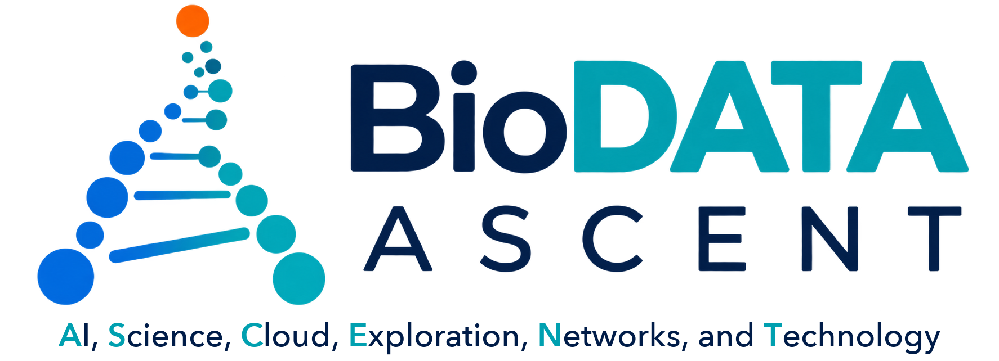
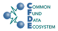
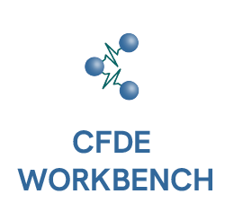
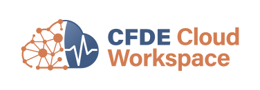
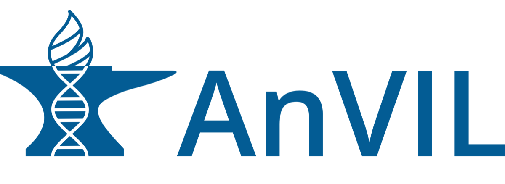
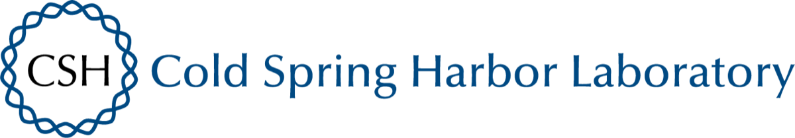

  

November 3-4, 2026 · Cold Spring Harbor Laboratory, New York · In person

  
<a href="https://forms.gle/xKgVN9M2YeVgpwSu8" style="display: inline-block; padding: 12px 24px; background-color: #0969da; color: #ffffff; border-radius: 6px; font-weight: 600; text-decoration: none;">Register for BioDATA ASCENT</a>

 

Join the BioDATA ASCENT code-a-thon, an intensive, hands-on event where early-career researchers use cloud computing, AI, and large-scale biological and biomedical data to turn interesting biological questions into working analyses.

Hosted by [Allissa Dillman](https://www.biodatasage.com/about) (BioDataSage) and [Michael Schatz](http://schatz-lab.org/) (JHU) immediately before the 2026 CSHL [Biological Data Science Conference](https://meetings.cshl.edu/meetings.aspx?meet=DATA&year=26), this collaborative code-a-thon is designed especially for PhD students and postdocs. You’ll work in small teams alongside peers and mentors to explore real NIH-supported datasets, learn practical computational skills, and build something tangible: a prototype, analysis, reusable workflow, visualization, or next-step plan for a research project.

Brought to you by the [Common Fund Data Ecosystem (CFDE)](https://commonfund.nih.gov/dataecosystem) and the [NHGRI AnVIL](https://anvilproject.org/) programs, **ASCENT** brings together **A**I, **S**cience, **C**loud, **E**xploration, **N**etworks, and **T**echnology. No fully formed project is required: bring a scientific question, a technical skill, an early idea, or simply curiosity and a willingness to collaborate.

## What you’ll explore

Teams will have access to large biomedical datasets and resources from NIH Common Fund Data Ecosystem and the NHGRI AnVIL, including:

- [GTEx](https://gtexportal.org/home/) gene-expression data across human tissues
- [HuBMAP](https://portal.hubmapconsortium.org/) molecular and spatial maps of human cells
- [Kids First](https://portal.kidsfirstdrc.org/login?redirect_path=/dashboard) pediatric genomic data
- [MoTrPAC](https://www.motrpac.org/) multimodal data on molecular responses to physical activity
- [T2T references](https://github.com/marbl/CHM13) and [HPRC Pangenomes](https://humanpangenome.org/)
- [1000 Genomes](https://www.internationalgenome.org/) DNAseq and [MAGE](https://github.com/mccoy-lab/MAGE/) RNAseq resources
- [NIH Intramural Center for Alzheimer’s and Related Dementias](https://card.nih.gov/) (CARD) Long reads
- Cloud computing resources from the [CFDE Cloud Workspace Implementation Center](https://cfdeworkspace.org/) (CWIC) and [NHGRI AnVIL](https://anvilproject.org/)
- Many additional NIH-supported datasets and cloud-based research resources

## What you might build

Projects can take many forms. Teams can:

- Use machine learning or AI to predict tissue type, disease state, drug response, or other characteristics from multi-omics data
- Predict drug efficacy and side effects across populations
- Investigate the molecular impacts of exercise on health and diseases
- Leverage the human pangenome to improve the analysis of human genetic diversity
- Develop new approaches for finding, combining, and interpreting biomedical data
- Test AI-assisted methods for research discovery
- Turn a promising research question into an initial analysis or prototype

**Have an idea for a potential team project?** Please reach out to [Allissa Dillman](mailto:adillman@biodatasage.com) and [Mike Schatz](mailto:mschatz@cs.jhu.edu) to discuss it further.

By the end of the event, each team will present what they built, draft blog posts & manuscripts, identify next steps, and make connections that can continue beyond the code-a-thon.

## Schedule

### Tuesday, November 3 @ 7:00 - 9:00 pm ET

**Welcome, orientation, and team formation**

- Meet fellow participants and mentors
- Get an overview of available datasets, cloud resources, and project possibilities
- Share ideas, pitch projects, and form teams

### Wednesday, November 4 @ 9:00 am - 5:00 pm ET

**Project Day**

- **Morning:** Team-based project development
- **Midday:** Progress check-ins, mentor support, and cross-team discussion
- **Afternoon:** Final development, documentation, and preparation of results
- **By 5:00 p.m.:** Team presentations, wrap-up, and next steps
- Dinner begins at 5:30, the main conference opens at 7:30pm

Dinner will be available from 5:30-7:00 p.m. on both days. Breakfast is served from 7:30-9:00 a.m., and lunch from noon-1:30 p.m.

## What to bring

Bring your laptop, your ideas, and your curiosity. You are welcome to arrive with a research question, project concept, or technical skill to share, but none are required.

## Registration

Participants with a range of biological and computational backgrounds are welcome; no prior cloud-computing or AI experience is required.

[Register for the BioDATA ASCENT code-a-thon](https://forms.gle/xKgVN9M2YeVgpwSu8) using our participant registration form. **There is no cost to join the code-a-thon.**

The additional night of housing on November 3 costs **$255**. This charge includes dinner on November 3 and meals on November 4. Participants attending the [Biological Data Science Conference](https://meetings.cshl.edu/meetings.aspx?meet=DATA&year=26) should make sure to request housing beginning November 3.

## Questions?

Keep an eye on the [BioDATA-ASCENT GitHub](https://github.com/BioDATA-ASCENT) or email [mschatz@cs.jhu.edu](mailto:mschatz@cs.jhu.edu) and [adillman@biodatasage.com](mailto:adillman@biodatasage.com)

## Acknowledgements

  &nbsp;&nbsp;
  &nbsp;&nbsp;
  &nbsp;&nbsp;
  &nbsp;&nbsp;
  

Thanks to the NIH Common Fund Data Ecosystem (CFDE) Training Center, CFDE Cloud Workspace Implementation Center (CWIC), NHGRI AnVIL, and Cold Spring Harbor Laboratory
